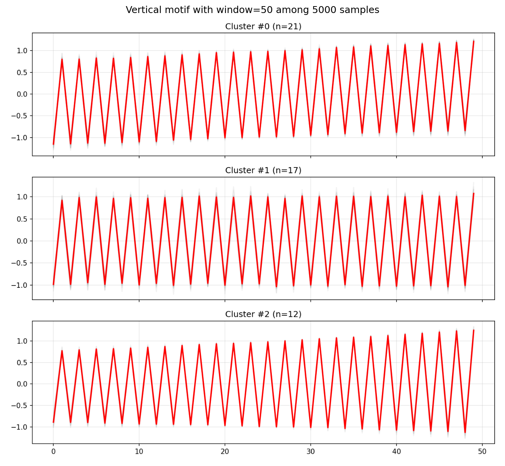
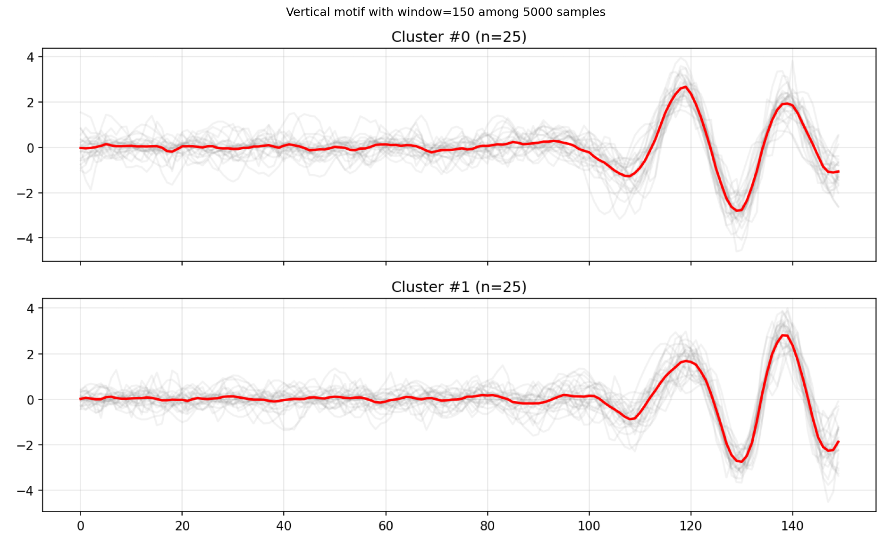
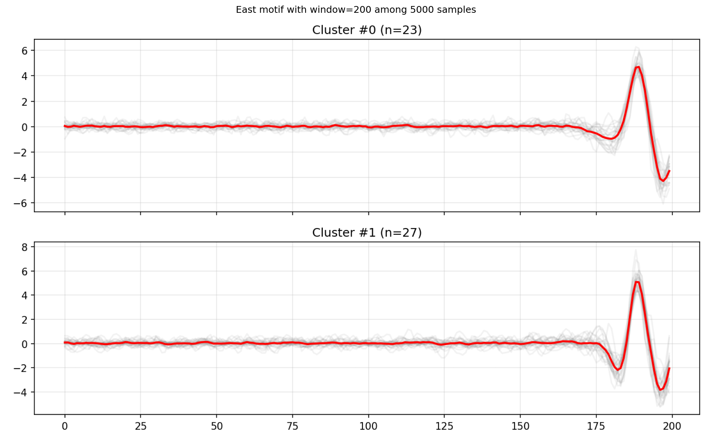
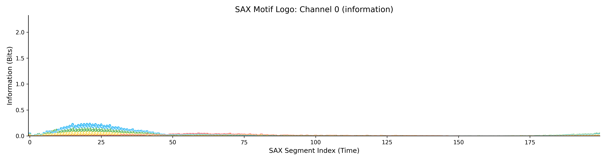

# Seismic Motif Discovery: Unsupervised Pattern Mining in Earthquake Signals

## 📌 Project Overview

This project applies **Matrix Profile** and **SAX (Symbolic Aggregate approXimation)** algorithms to discover recurring sub-sequences (motifs) in multivariate time-series data from earthquake sensors. The primary objective is to identify **P-wave First Breaks** (onsets) without labeled training data and to understand how search space size, window length, and sensor channel orientation affect the quality of discovered patterns.

This study reveals a critical trade-off between **waveform stationarity** and **event transience**, demonstrating that "more data" can sometimes degrade detection quality if technical noise becomes the statistically dominant motif.

## 🧪 Experimental Setup

We performed a grid search across three dimensions to analyze motif evolution:

- **Dataset:** Earthquake signals (Magnitude > 3.8).
- **Database Sizes (N):** `[100, 1000, 5000]` signals.
- **Window Sizes (m):** `[50, 100, 150, 200]` samples.
- **Channels:** East (E), North (N), Vertical (Z).
- **Algorithm:** Matrix Profile (STUMPY) + K-Means Clustering (k selected via Silhouette Score).

Additionally, SAX analysis was conducted with:
- **Segment sizes:** `[20, 50, 100, 200]`
- **SAX alphabet sizes:** `[8, 16, 24]`
- **Discretization strategy:** Quantile-based SAX (equal-frequency binning)

## 📊 Key Findings & Analysis

### 1. The "Scale Paradox" (N=100 vs N=5000)

Contrary to the assumption that larger datasets yield better models, we observed a degradation in motif quality at N=5000 for the Vertical channel.

- **Small Scale (N=100):** The algorithm successfully clustered geological P-wave onsets.
- **Large Scale (N=5000):** A **"Noise Trap"** emerged. Low-variance technical artifacts (e.g., 50Hz mains hum, sensor resonance) formed tighter mathematical clusters than the highly variable earthquake signals. The algorithm prioritized "perfect" noise matches over "imperfect" geological matches.



### 2. The Resolution Trade-off (Window Size)

The window size (m) acted as a filter for different physical properties:

- **m=50 (Transient Filter):** Captures the **Impulse Response**. Excellent for precise timing (high frequency) but lacks context, making it prone to false positives.
- **m=100 (Periodic Trap):** Inadvertently matches the period of **Surface Waves** (Rayleigh/Love). This window failed to detect onsets, instead locking onto the high-amplitude rolling motion of the S-wave coda.
- **m=200 (State Change Detector):** The **Gold Standard** for detection. By including ~150 samples of pre-event silence, this window maximizes the Signal-to-Noise Ratio (SNR) contrast (`Silence -> Spike`), proving the event is geological.

### 3. Channel Polarization

- **Vertical (Z):** Best for **Phase Picking**. Captures the sharpest P-wave impulses (compressional waves) at m=150. However, it is highly susceptible to resonance noise at scale.
  
- **East (E):** Best for **Robust Detection**. The most stable channel at m=200, resisting the high-frequency noise that corrupted the Z-channel.
  
- **North (N):** Unreliable for onsets. Dominated by horizontal **Love Waves**, obscuring the P-wave arrival. May be useful for sinusodial-like recurring patterns right on shockwave.
  

### 4. SAX Pattern Mining Findings

Using Piecewise Aggregate Approximation (PAA) followed by Symbolic Aggregate approXimation (SAX), we investigated recurring waveform patterns between P-arrival and S-arrival phases across E, N, and V channels.

- **Recurring Motif in E and N Channels:** A clear, stable recurring motif was detected in nearly all segment/bin combinations for horizontal components. This pattern appears immediately after P-arrival, peaks in the early coda window, and decays before S-arrival, showing high symbol redundancy (high information peaks) around segments 10–45. This corresponds to **P-wave coda**, dominated by crustal heterogeneity scattering, layer reverberations, and weak P→S converted phases.
- **Vertical Channel (V) Absence:** The V channel did not consistently exhibit the same motif, due to stronger horizontal propagation of coda phases, lower SNR in vertical components, and faster attenuation in layered structures.
- **Parameter Effects:** Segment sizes 50–100 provided stable motif resolution; alphabet sizes 16–24 produced clearest logo plots. Quantile discretization ensured balanced symbol usage.



## 🚀 Proposed Pipeline

Based on these findings, we propose a 3-stage hybrid detection system:

1. **Triggering (Recall):** Scan **East and North Channel (m=200)** for the "Silence → Spike" motif.
   
   
2. **Picking (Precision):** Refine arrival time using **Vertical Channel (m=150)** to capture the sharpest onset.
   
3. **Quality Control:** Use the "Sawtooth" noise motif discovered at N=5000 as a negative class to automatically flag and discard sensor errors.
   

## 📂 Repository Structure

```
├── metadata/                      # Processed metadata files
├── motif_results_stumpy/          # Stumpy motif results
├── sax/                           # SAX pattern mining related
├── signal_data/                   # Processed seismic data
├── stumpy/                        # Stumpy-related outputs
├── eda.ipynb                      # Exploratory Data Analysis notebook
├── preprocess_earthquakes.ipynb   # Preprocessing notebook
├── sax_pattern_mining.ipynb       # SAX pattern mining notebook
├── stumpy_pattern_mining_gpu.ipynb # GPU-accelerated Stumpy mining
├── select_eq_vf.py                # Script for selecting earthquakes
└── README.md                      # This file
```

## 🔧 Installation and Setup

### Prerequisites

- Python 3.8+
- GPU with CUDA support (for GPU-accelerated Stumpy)
- Required libraries: numpy, pandas, matplotlib, stumpy, scikit-learn, h5py

### Installation

1. Clone the repository:
   ```bash
   git clone https://github.com/alperendemirciai/STEAD-Pattern-Mining.git 
   cd STEAD-Pattern-Mining
   ```

2. Install dependencies:
   ```bash
   pip install numpy pandas matplotlib stumpy scikit-learn h5py cupy-12x
   ```

3. For GPU support, ensure CUDA is installed and use the GPU-enabled Stumpy functions.

### Data Preparation

The project uses the STEAD dataset. Download the dataset from [STEAD Repository](https://github.com/smousavi05/STEAD) and place the `merge.hdf5` and `merge.csv` files in a `data/` directory.

Run the preprocessing notebook `preprocess_earthquakes.ipynb` to prepare the data.

## 📖 Usage

### Analysis

1. **Exploratory Data Analysis:** Use `eda.ipynb` to explore the dataset.

2. **Preprocessing:** Use `preprocess_earthquakes.ipynb` to filter and process the seismic data.

3. **SAX Pattern Mining:** Execute `sax_pattern_mining.ipynb` for symbolic aggregate approximation analysis.

4. **Stumpy GPU Mining:** Run `stumpy_pattern_mining_gpu.ipynb` for Matrix Profile computation and motif discovery.


## 📈 Results

Results are stored in `experiments_auto_k/` with plots and metadata for each experiment configuration. Key visualizations include centroid plots, PCA projections, and silhouette scores.

## 👥 Contributors

- [Alperen Demirci](https://www.linkedin.com/in/alperendemirci/)

## 📎 References

1. **Keogh, E., et al.** "Matrix Profile VI: Meaningful Multidimensional Motif Discovery."
2. **IRIS.** "Seismic Wave Motions—4 waves animated." (Particle motion theory).
3. **Mousavi, S. M., et al.** "STanford EArthquake Dataset (STEAD): A Global Data Set of Seismic Signals for AI." (2019).
4. **Law, Sean M.** "STUMPY: A Powerful and Scalable Python Library for Time Series Data Mining"
5. **Johann Faouzi and Hicham Janati** "pyts: A Python Package for Time Series Classification"

## 📄 License

This project is licensed under the MIT License - see the LICENSE file for details.
